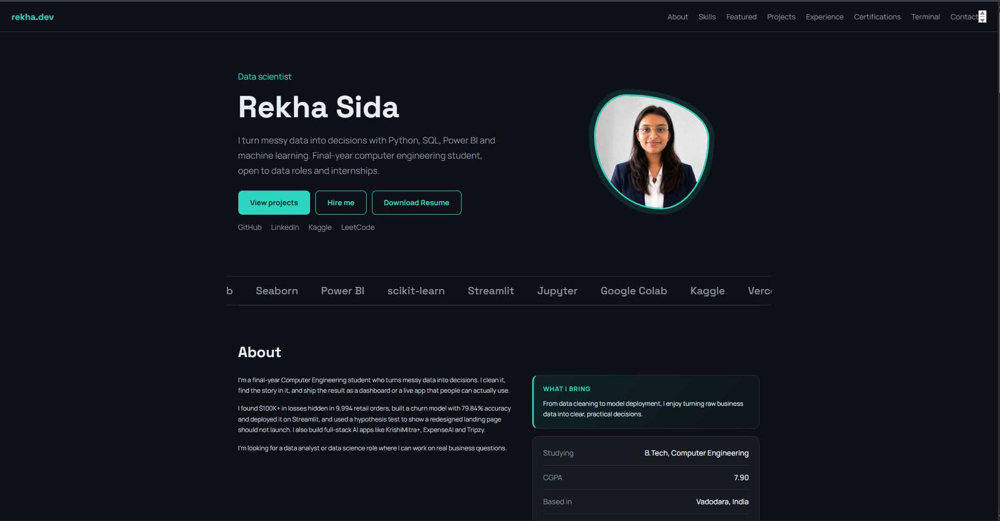

# Rekha Sida | Portfolio

Personal portfolio website for data analyst and data scientist roles, built with React and Vite.

**Live site:** [rekha-sida-portfolio.vercel.app](https://rekha-sida-portfolio.vercel.app/)



## About

This site presents my data analysis, machine learning and full-stack AI projects, along with my skills, experience and certifications. The goal is to let a recruiter see my best work, with live demos and code links, within a minute.

## Features

- **Featured projects:** top projects with highlight badges, GitHub links and live demos
- **All projects:** every project I've built, with filters for data analysis, machine learning and full-stack AI
- **Skills explorer:** skills grouped into tabs (programming, data analysis, machine learning, visualization, tools and deployment, web development)
- **Scrolling skills ticker** that pauses on hover
- **Interactive terminal:** visitors can type `help`, `about`, `skills`, `show-projects`, `contact`, `github` or `clear`
- **Experience, education and certifications** sections
- **Responsive layout** for phones, tablets and desktops
- **Hover effects and scroll-reveal animations**, which switch off for visitors who prefer reduced motion
- **Single data file:** all content lives in `src/data.js`, so updates are quick

## Featured work

| Project | What it does |
|---|---|
| Customer Churn Prediction | Predicts telecom churn with 79.84% accuracy, deployed as a live Streamlit app |
| E-commerce Sales Analysis | Finds $100K+ in losses across 9,994 orders with Python, SQL and Power BI |
| KrishiMitra+ | Crop disease detection (about 98% validation accuracy) plus a farmer and worker marketplace |
| ExpenseAI | AI-powered personal finance app for Indian users |

## Tech stack

- React 18
- Vite 5
- Plain CSS (no UI library)
- Deployed on Vercel

## Project structure

```
MY_PORTFOLIO/
├── index.html          # Page shell, fonts and meta tags
├── package.json        # Dependencies and scripts
├── vite.config.js      # Vite configuration
├── preview.png         # Screenshot used in this README
└── src/
    ├── main.jsx        # App entry point
    ├── App.jsx         # All page sections and components
    ├── data.js         # Projects, skills, experience, certifications, links
    └── styles.css      # All styling
```

## Run locally

You need [Node.js](https://nodejs.org/) (LTS version).

```bash
git clone https://github.com/rekhashida/MY_PORTFOLIO.git
cd MY_PORTFOLIO
npm install
npm run dev
```

Then open the local address shown in the terminal (usually `http://localhost:5173`).

To create a production build:

```bash
npm run build
npm run preview
```

## Customize

Edit `src/data.js` to change:

- `LINKS`: email and social profiles
- `PROJECTS`: add or edit projects (set `featured: true` and `hl` to show one in the featured section)
- `SKILL_TABS`: skill groups and descriptions
- `EXPERIENCE`, `EDUCATION`, `CERTS`: timeline and certification entries

## Deployment

The site deploys on Vercel. Importing the repo on [vercel.com](https://vercel.com/) detects Vite automatically (build command `npm run build`, output folder `dist`). Every push to `main` redeploys the site.

## Contact

- Email: [rekhashida5@gmail.com](mailto:rekhashida5@gmail.com)
- LinkedIn: [rekha-sida-rs576](https://www.linkedin.com/in/rekha-sida-rs576/)
- GitHub: [rekhashida](https://github.com/rekhashida)
- Kaggle: [rekhashida](https://www.kaggle.com/rekhashida)
